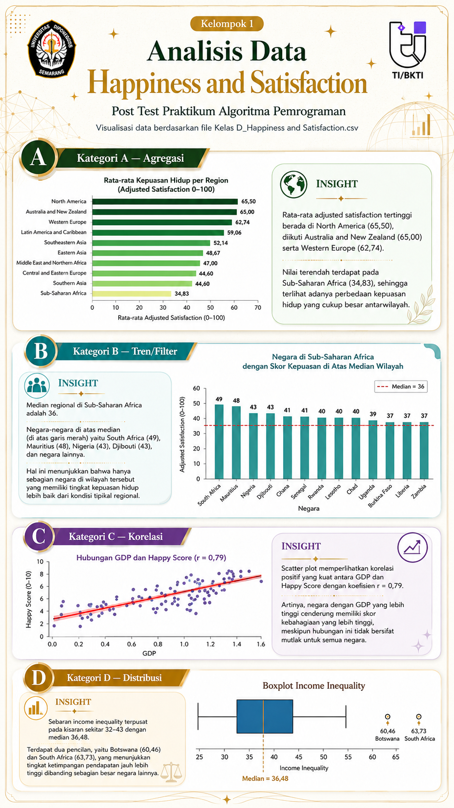

# 📊 Post Test & Prajilid — Praktikum Algoritma Pemrograman 2026
### Visualisasi Data Kebahagiaan Dunia menggunakan Python


---

## 👥 Anggota Kelompok 1

| No | Nama | NIM | Tugas |
|----|------|-----|-------|
| 1 | Faisal Al Hafiz Siregar | 21060125130071 | Soal E + Koordinasi Infografis & PPT |
| 2 | Nabila Nur Fitri Arifin | 21060125140164 | Soal C (Korelasi) |
| 3 | Nisrina Najwa Luthfiyyah | 21060125130118 | Soal D (Distribusi) |
| 4 | Timoty Turnip | 21060125130125 | Soal B (Tren/Filter) + Kelola GitHub |
| 5 | Vimoty Turnip | 21060125140137 | Soal A (Agregasi) |

---
## 🖼️ Infografis Kelompok 1

<p align="center">
  <b>Visualisasi Data Kebahagiaan Dunia</b><br>
  <i>Happiness and Satisfaction Dataset</i>
</p>

<p align="center">
  <a href="https://github.com/omitaja/PostTest_PraktikumAlgoritmaPemrogramman_Kelompok_1_Kelas_D/blob/main/Infografis_PostTest_Praktikum_Algoritma_Pemrogramman.png">
    
  </a>
</p>

<p align="center">
  <a href="https://github.com/omitaja/PostTest_PraktikumAlgoritmaPemrogramman_Kelompok_1_Kelas_D/blob/main/Infografis_PostTest_Praktikum_Algoritma_Pemrogramman.png">
    🔍 Klik untuk melihat infografis ukuran penuh
  </a>
</p>


## 📋 Pembagian Tugas Detail

<details>
<summary>🔵 <b>Vimo — Soal A (Kategori Agregasi)</b></summary>

### Pengolahan Data
- Menghitung rata-rata kepuasan hidup (`adjusted_satisfaction`, skala 0–100) berdasarkan wilayah regional (`Region`)
- Visualisasi menggunakan **Horizontal Bar Chart** dengan pendekatan `ax=axes[0, 0]`

### Infografis
- Membuat desain layout infografis Grafik A
- Menyusun insight/kesimpulan singkat hasil analisis agregasi

### PPT
- Membuat slide presentasi bagian analisis Grafik A

</details>

---

<details>
<summary>🟠 <b>Timo — Soal B (Kategori Tren/Filter) + Kelola GitHub</b></summary>

### Pengolahan Data
- Menemukan negara di wilayah **Sub-Saharan Africa** yang memiliki skor kepuasan di atas nilai median wilayah tersebut
- Visualisasi menggunakan **Bar Chart** dengan pendekatan `ax=axes[0, 1]`

### Infografis
- Membuat desain layout infografis Grafik B
- Menyusun insight/kesimpulan singkat hasil analisis tren/filter

### PPT
- Membuat slide presentasi bagian analisis Grafik B

### GitHub (Kelola Repository)
- Membuat dan mengelola repository kelompok
- Meng-upload source code `.ipynb`, dataset, dan file pendukung
- Memastikan struktur repository rapi dan lengkap
- Mencantumkan rincian jobdesk seluruh anggota

</details>

---

<details>
<summary>🩷 <b>Nabila — Soal C (Kategori Korelasi)</b></summary>

### Pengolahan Data
- Menganalisis hubungan korelasi antara skor kebahagiaan (**Happy Score**, skala 0–10) dengan tingkat **GDP** negara
- Visualisasi menggunakan **Scatter Plot** dengan pendekatan `ax=axes[1, 0]`

### Infografis
- Membuat desain layout infografis Grafik C
- Menyusun insight/kesimpulan singkat hasil analisis korelasi

### PPT
- Membuat slide presentasi bagian analisis Grafik C

</details>

---

<details>
<summary>🟡 <b>Nisrina — Soal D (Kategori Distribusi)</b></summary>

### Pengolahan Data
- Mencari sebaran dan pencilan pada kolom ketimpangan pendapatan (`income_inequality`)
- Visualisasi menggunakan **Boxplot** dengan pendekatan `ax=axes[1, 1]`

### Infografis
- Membuat desain layout infografis Grafik D
- Menyusun insight/kesimpulan singkat hasil analisis distribusi

### PPT
- Membuat slide presentasi bagian analisis Grafik D

</details>

---

<details>
<summary>🟢 <b>Faisal — Soal E (Grafik Gabungan) + Koordinasi Infografis & PPT</b></summary>

### Pengolahan Data
- Menggabungkan Grafik A, B, C, dan D ke dalam satu layout grid **2×2** menggunakan `plt.subplots(2, 2, figsize=(...))`
- Menggunakan pendekatan `ax=axes[x, y]` agar grafik individu dapat digabungkan tanpa menulis ulang logika data

### Infografis
- Mengintegrasikan desain infografis Grafik A–D dari seluruh anggota menjadi satu **infografis utuh** yang estetis dan profesional

### PPT
- Membuat slide cover, intro kelompok, dan slide penutup/kesimpulan keseluruhan

</details>

---

## 🤝 Tugas Bersama (Semua Anggota)

- [ ] Publikasi infografis ke **Instagram Story** (rasio 9:16) masing-masing akun dengan tag/mention pihak terkait
- [ ] Publikasi ke **LinkedIn** (rasio 1:1 / 4:5 atau format PDF Slider) masing-masing akun dengan tag/mention pihak terkait
- [ ] Mengisi formulir absensi yang telah disediakan

---

## 🗂️ Struktur Repository

```
📁 repository/
├── 📄 README.md
├── 📄 dataset.csv
├── 📓 posttest_kelompok1.ipynb
├── 📄 PPT/
└── 📄 Infografis/
```

---

## ⚙️ Library yang Digunakan

```python
import pandas as pd
import matplotlib.pyplot as plt
import seaborn as sns
```

---

## 📌 Ketentuan Teknis

| Ketentuan | Detail |
|-----------|--------|
| Format file | `.ipynb` (Jupyter Notebook) |
| Pendekatan visualisasi | `ax=axes[x, y]` (object-oriented) |
| Insight | Wajib disertakan pada setiap grafik |
| Standar visualisasi | Tidak boleh menampilkan grafik mentah tanpa analisis |

---

## 📈 Ringkasan Analisis

| Soal | Kategori | Jenis Grafik | Variabel Utama |
|------|----------|--------------|----------------|
| A | Agregasi | Horizontal Bar Chart | `adjusted_satisfaction` per `Region` |
| B | Tren/Filter | Bar Chart | Negara Sub-Saharan Africa di atas median |
| C | Korelasi | Scatter Plot | `Happy Score` vs `GDP` |
| D | Distribusi | Boxplot | `income_inequality` |
| E | Gabungan | Grid 2×2 | Semua grafik A–D |

---

<p align="center">
  <i>Praktikum Algoritma Pemrograman 2026 — Kelompok 1</i>
</p>
